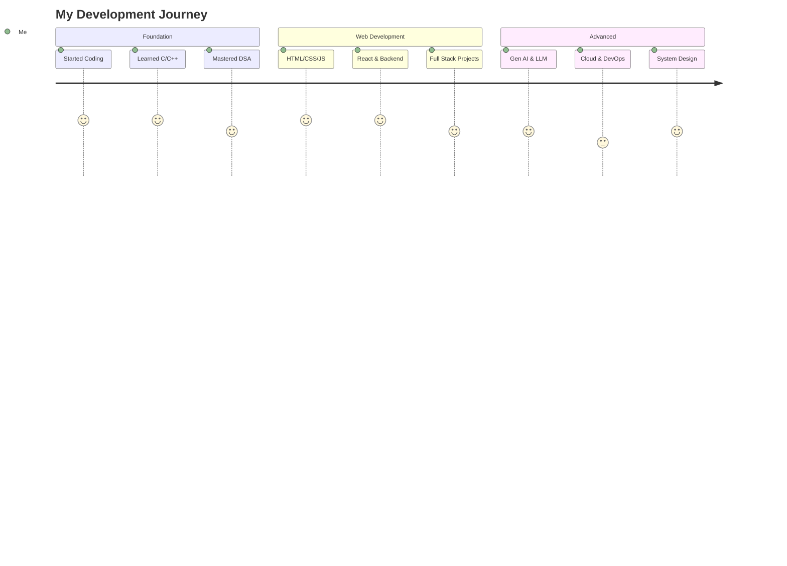
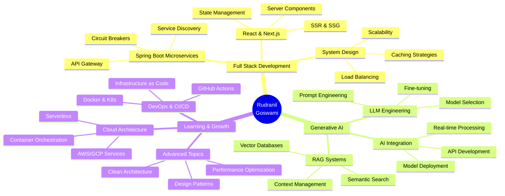

```mermaid
graph LR
    A[Programming<br/>Fundamentals] --> B[Web<br/>Development]
    B --> C[Backend<br/>Frameworks]
    C --> D[Database<br/>Design]
    D --> E[Full Stack<br/>Projects]
    E --> F[Cloud &<br/>DevOps]
    F --> G[AI/ML<br/>Integration]
    G --> H[System<br/>Design]
    H --> I[Currently:<br/>LLM Engineering]
    
    style A fill:#339AF0
    style B fill:#339AF0
    style C fill:#339AF0
    style D fill:#339AF0
    style E fill:#339AF0
    style F fill:#845EF7
    style G fill:#845EF7
    style H fill:#845EF7
    style I fill:#00C853,color:#000
```

<div align="center">
  
</div>

<div align="center">
  
  [](https://git.io/typing-svg)

</div>

<div align="center">
  
[](https://portfolio-me-ycdu.onrender.com)
[](https://linkedin.com/in/rudranil-goswami-a33340298)
[](https://stackoverflow.com/users/rudranil-goswami)
[](https://x.com/NilTatai77986)
[](mailto:tatairudra39@gmail.com)


</div>

<br/>

<p align="center">
  
</p>

<div align="center">

### 🌐 Check Out My Portfolio

[](https://portfolio-me-ycdu.onrender.com)

*Explore my projects, skills, and professional journey!*

</div>

<br/>


## 👨‍💻 About Me

```javascript
const rudranil = {
    pronouns: "He/Him",
    location: "Durgapur, West Bengal, India",
    portfolio: "https://portfolio-me-ycdu.onrender.com",
    currentFocus: ["Full Stack Development", "Generative AI", "System Design"],
    learning: ["Java Full Stack", "LLM Engineering", "Cloud Architecture"],
    
    funFact: "I once built a project that accidentally turned into a powerful Developer tool.",
    
    currentlyWorking: "Full Stack E-commerce Platform",
    openTo: ["Collaborations", "Open Source", "Mentorship"],
    
    askMeAbout: [
        "Web Development",
        "Generative AI",
        "Django & Spring Boot",
        "Compiler Design",
        "Data Structures & Algorithms"
    ],
    
    lifePhilosophy: "Code with passion, debug with patience, deploy with confidence!"
};
```

<br clear="right"/>

---

## 🚀 My Coding Journey

<div align="center">



</div>

---

## 🛠️ Tech Stack

<div align="center">

### Languages & Frameworks

<table>
<tr>
<td align="center" width="96">

<br>Java
</td>
<td align="center" width="96">

<br>Python
</td>
<td align="center" width="96">

<br>JavaScript
</td>
<td align="center" width="96">

<br>React
</td>
<td align="center" width="96">

<br>Django
</td>
<td align="center" width="96">

<br>C++
</td>
<td align="center" width="96">

<br>MySQL
</td>
</tr>
<tr>
<td align="center" width="96">

<br>REST API
</td>
<td align="center" width="96">

<br>Docker
</td>
<td align="center" width="96">

<br>GitHub
</td>
<td align="center" width="96">

<br>AWS
</td>
<td align="center" width="96">

<br>MongoDB
</td>
<td align="center" width="96">

<br>Node.js
</td>
<td align="center" width="96">

<br>Firebase
</td>
</tr>
</table>

</div>

<details open>
<summary><b>💻 Languages</b></summary>
<br/>


</details>

<details open>
<summary><b>🎨 Frontend Development</b></summary>
<br/>


</details>

<details open>
<summary><b>⚙️ Backend & AI/ML</b></summary>
<br/>


</details>

<details open>
<summary><b>🗄️ Databases & Cloud</b></summary>
<br/>


</details>

<details open>
<summary><b>🔧 Tools & DevOps</b></summary>
<br/>


</details>

---

## 📊 GitHub Statistics

<div align="center">
  
  
  
  

</div>

<div align="center">
  
  
  
  

</div>

<br/>

<div align="center">
  
</div>

---

## 🐍 Contribution Snake

<div align="center">
  <picture>
    <source media="(prefers-color-scheme: dark)" srcset="https://raw.githubusercontent.com/rudra00434/rudra00434/output/github-contribution-grid-snake-dark.svg">
    <source media="(prefers-color-scheme: light)" srcset="https://raw.githubusercontent.com/rudra00434/rudra00434/output/github-contribution-grid-snake.svg">
    
  </picture>
</div>

---

## 💼 Featured Projects

<div align="center">

<table>
<tr>
<td width="50%">
<h3 align="center">🛒 E-Commerce Platform</h3>
<div align="center">


<br><br>
<p>Full-stack e-commerce solution with payment gateway integration, real-time inventory management, and admin dashboard. Features include user authentication, cart management, order tracking, and analytics.</p>
<p>
<a href="#" target="_blank">

</a>
<a href="#" target="_blank">

</a>
</p>
</div>
</td>

<td width="50%">
<h3 align="center">🤖 AI Chatbot with RAG</h3>
<div align="center">


<br><br>
<p>Intelligent chatbot powered by Large Language Models with Retrieval Augmented Generation. Implements semantic search, context-aware responses, and conversation memory for enhanced user interactions.</p>
<p>
<a href="#" target="_blank">

</a>
<a href="#" target="_blank">

</a>
</p>
</div>
</td>
</tr>

<tr>
<td width="50%">
<h3 align="center">📊 Data Analytics Dashboard</h3>
<div align="center">


<br><br>
<p>Real-time data visualization dashboard with interactive charts, customizable reports, and data export functionality. Processes large datasets efficiently with advanced filtering and analytics.</p>
<p>
<a href="#" target="_blank">

</a>
<a href="#" target="_blank">

</a>
</p>
</div>
</td>

<td width="50%">
<h3 align="center">🎮 Developer Productivity Tool</h3>
<div align="center">


<br><br>
<p>Developer productivity enhancer with code snippet manager, project templates, and automation tools. Streamlines workflow with keyboard shortcuts and intelligent code suggestions.</p>
<p>
<a href="#" target="_blank">

</a>
<a href="#" target="_blank">

</a>
</p>
</div>
</td>
</tr>
</table>

</div>

---

## 🎯 Current Focus

<div align="center">



</div>

---

## 📈 Weekly Development Breakdown

<!--START_SECTION:waka-->
```text
Java         8 hrs 45 mins   ███████████░░░░░░░░░░   45.2%
Python       5 hrs 20 mins   ███████░░░░░░░░░░░░░░   27.6%
JavaScript   3 hrs 15 mins   ████░░░░░░░░░░░░░░░░░   16.8%
SQL          1 hr 30 mins    ██░░░░░░░░░░░░░░░░░░░    7.8%
Others       0 hrs 30 mins   █░░░░░░░░░░░░░░░░░░░░    2.6%
```
<!--END_SECTION:waka-->

---

## 🎨 Skill Proficiency

<div align="center">

### Core Strengths


</div>

<table align="center">
<tr>
<td width="50%">

### Backend Development
```text
Java Spring Boot     ████████████████████░   95%
Python Django        ███████████████████░░   90%
Node.js & Express    ████████████████░░░░░   85%
RESTful API Design   ███████████████████░░   90%
Microservices        ███████████████░░░░░░   80%
```

</td>
<td width="50%">

### Frontend Development
```text
React.js             ████████████████████░   90%
JavaScript/ES6+      ███████████████████░░   88%
HTML5 & CSS3         ████████████████████░   95%
TailwindCSS          ████████████████░░░░░   85%
Redux State Mgmt     ███████████████░░░░░░   80%
```

</td>
</tr>
<tr>
<td width="50%">

### Database & Cloud
```text
MySQL & PostgreSQL   ███████████████████░░   90%
MongoDB              ████████████████░░░░░   85%
Firebase             ███████████████░░░░░░   80%
Redis Caching        ██████████████░░░░░░░   75%
AWS Services         ███████████████░░░░░░   78%
```

</td>
<td width="50%">

### AI/ML & Tools
```text
Gen AI & LLMs        ████████████████░░░░░   82%
Python ML Libraries  ███████████████░░░░░░   80%
Git & GitHub         ████████████████████░   95%
Docker & K8s         ███████████████░░░░░░   78%
CI/CD Pipelines      ██████████████░░░░░░░   72%
```

</td>
</tr>
</table>

---

## 🏆 Achievements & Highlights

<div align="center">

<table>
<tr>
<td align="center" width="25%">

<br><b>Projects Completed</b>
</td>
<td align="center" width="25%">

<br><b>GitHub Stars</b>
</td>
<td align="center" width="25%">

<br><b>Total Contributions</b>
</td>
<td align="center" width="25%">

<br><b>Repositories</b>
</td>
</tr>
</table>

</div>

### 🌟 Milestones

```diff
+ 🎓 Mastered Full Stack Development with Java & Python
+ 💡 Successfully integrated AI/ML into production applications
+ 🚀 Deployed multiple scalable microservices architectures
+ 🤝 Contributed to open source projects and helped 100+ developers
+ 📚 Continuous learner - always exploring new technologies
+ 🏅 Built a tool that's now used by multiple development teams
```

---

## 📚 Learning Path

<div align="center">



</div>

---

## 💡 What I'm Working On

<div align="center">

| 🎯 Current Projects | 📖 Learning | 🔮 Next Goals |
|:---:|:---:|:---:|
| E-Commerce Platform | Advanced System Design | Contribute to Major OSS |
| AI Chatbot with RAG | Kubernetes & Cloud Native | Build SaaS Product |
| Developer Tools | LLM Fine-tuning | Tech Blog & Tutorials |
| Open Source Contributions | Performance Optimization | Speaking at Conferences |

</div>

---

## 🤝 Let's Collaborate On

<div align="center">

<table>
<tr>
<td width="33%" align="center">

<h3>Open Source</h3>
<p>Contributing to meaningful projects that impact developers worldwide</p>
</td>
<td width="33%" align="center">

<h3>AI Projects</h3>
<p>Building intelligent applications with Gen AI and LLMs</p>
</td>
<td width="33%" align="center">

<h3>Innovation</h3>
<p>Creating tools that solve real problems and enhance productivity</p>
</td>
</tr>
</table>

</div>

---

## 📝 Latest Blog Posts

<div align="center">

<!-- BLOG-POST-LIST:START -->
- 🚀 Building Scalable Microservices with Spring Boot
- 🤖 A Deep Dive into RAG Systems and Vector Databases  
- ⚡ Optimizing React Performance: Best Practices
- 🔐 Implementing JWT Authentication in Spring Security
- 📊 Real-time Data Processing with Apache Kafka
<!-- BLOG-POST-LIST:END -->

</div>

---

## 🎯 2026 Goals

<div align="center">

| Goal | Progress | Status |
|:-----|:---------|:-------|
| 🚀 Launch SaaS Product | ████████░░ 80% | 🏃 In Progress |
| 📝 Write 50 Technical Articles | ████░░░░░░ 40% | 🏃 In Progress |
| 🤝 Contribute to 10 OSS Projects | ██████░░░░ 60% | 🏃 In Progress |
| 🎓 Master System Design | ███████░░░ 70% | 🏃 In Progress |
| 🌟 Reach 100 GitHub Stars | ███████░░░ 70% | 🏃 In Progress |
| 🏅 Speak at Tech Conference | ████░░░░░░ 40% | 🎯 Planned |

</div>

---

## 💬 Random Dev Quote

<div align="center">
  
</div>

---

## 🎮 Fun Corner

<div align="center">

### When I'm not coding, you'll find me:

🎵 Exploring new music genres | 📚 Reading tech blogs & documentation | ♟️ Playing strategic games
<br/>
🌍 Learning about new technologies | 💪 Working out | 🍜 Trying new cuisines

### My Coding Setup:

```yaml
Editor: VS Code with Tokyo Night Theme
Terminal: Oh My Zsh with Powerlevel10k
Font: Fira Code (with ligatures)
Coffee: ☕ Black, no sugar
Music: 🎧 Lo-fi beats while coding
Keyboard: ⌨️ Mechanical (Blue switches)
```

</div>

---

## 📫 Get In Touch

<div align="center">

```diff
+ 💼 Open to collaborating on innovative projects
+ 🌱 Always learning and exploring new technologies  
+ 💬 Feel free to reach out for technical discussions
+ 🤝 Happy to help with debugging and code reviews
+ 📧 Best way to reach me: tatairudra39@gmail.com
+ 🔗 Let's connect on LinkedIn for professional networking
```

<br/>

### 📬 How to reach me:

[](https://portfolio-me-ycdu.onrender.com)

[](mailto:tatairudra39@gmail.com)
[](https://linkedin.com/in/rudranil-goswami-a33340298)
[](https://x.com/NilTatai77986)

<br/>

### ⚡ Quick Links:

🌐 [**Portfolio Website**](https://portfolio-me-ycdu.onrender.com) | 📝 [Tech Blog](#) | 💻 [Code Snippets](#) | 📚 [Resources](#)

</div>

---

<div align="center">

### 💭 Developer Wisdom

**"First, solve the problem. Then, write the code."** — *John Johnson*

**"Code is like humor. When you have to explain it, it's bad."** — *Cory House*

**"Make it work, make it right, make it fast."** — *Kent Beck*

</div>

---

<div align="center">

### 🌟 Show some ❤️ by starring some repositories!

<br/>


<br/>

**Thanks for visiting my profile! Have a great day! 😊**

</div>

---

<div align="center">
  
</div>

