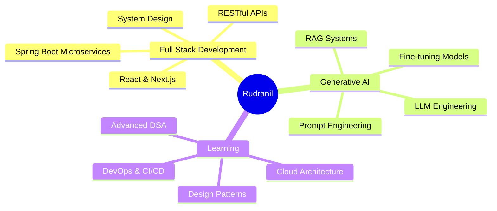

<div align="center">
  
</div>

<div align="center">
  
  [](https://git.io/typing-svg)

</div>

<div align="center">
  
[](https://linkedin.com/in/rudranil-goswami-a33340298)
[](https://stackoverflow.com/users/rudranil-goswami)
[](https://x.com/NilTatai77986)
[](mailto:tatairudra39@gmail.com)


</div>

<br/>


## 👨‍💻 About Me

```javascript
const rudranil = {
    pronouns: "He/Him",
    location: "Durgapur, West Bengal, India",
    currentFocus: ["Full Stack Development", "Generative AI", "System Design"],
    learning: ["Java Full Stack", "LLM Engineering", "Cloud Architecture"],
    
    funFact: "I once built a project that accidentally turned into a powerful Developer tool.",
    
    currentlyWorking: "Full Stack E-commerce Platform",
    openTo: ["Collaborations", "Open Source", "Mentorship"],
    
    askMeAbout: [
        "Web Development",
        "Generative AI",
        "Django & Spring Boot",
        "Compiler Design",
        "Data Structures & Algorithms"
    ]
};
```

<br clear="right"/>

---

## 🛠️ Tech Stack

<details open>
<summary><b>💻 Languages</b></summary>
<br/>


</details>

<details open>
<summary><b>🎨 Frontend Development</b></summary>
<br/>


</details>

<details open>
<summary><b>⚙️ Backend & AI/ML</b></summary>
<br/>


</details>

<details open>
<summary><b>🗄️ Databases & Cloud</b></summary>
<br/>


</details>

<details open>
<summary><b>🔧 Tools & DevOps</b></summary>
<br/>


</details>

---

## 📊 GitHub Statistics

<div align="center">
  
  
  
  

</div>

<div align="center">
  
  
  
  

</div>

<br/>

<div align="center">
  
</div>

---

## 🐍 Contribution Snake

<div align="center">
  <picture>
    <source media="(prefers-color-scheme: dark)" srcset="https://raw.githubusercontent.com/rudra00434/rudra00434/output/github-contribution-grid-snake-dark.svg">
    <source media="(prefers-color-scheme: light)" srcset="https://raw.githubusercontent.com/rudra00434/rudra00434/output/github-contribution-grid-snake.svg">
    
  </picture>
</div>

---

## 🎯 Current Focus



---

## 📈 Weekly Development Breakdown

<!--START_SECTION:waka-->
```text
Java         8 hrs 45 mins   ███████████░░░░░░░░░░   45.2%
Python       5 hrs 20 mins   ███████░░░░░░░░░░░░░░   27.6%
JavaScript   3 hrs 15 mins   ████░░░░░░░░░░░░░░░░░   16.8%
SQL          1 hr 30 mins    ██░░░░░░░░░░░░░░░░░░░    7.8%
Others       0 hrs 30 mins   █░░░░░░░░░░░░░░░░░░░░    2.6%
```
<!--END_SECTION:waka-->

---

## 🏆 Achievements & Highlights

<div align="center">

| 🎯 Projects Completed | ⭐ Stars Earned | 🔱 Forks | 📝 Repositories |
|:---:|:---:|:---:|:---:|
| 25+ | 50+ | 30+ | 40+ |

</div>

### 💡 Notable Projects

- 🛒 **E-Commerce Platform** - Full-stack application with payment integration
- 🤖 **AI Chatbot** - LLM-powered conversational agent with RAG
- 📊 **Data Analytics Dashboard** - Real-time data visualization tool
- 🎮 **Developer Tool** - Productivity enhancer for developers

---

## 📫 Let's Connect!

<div align="center">

```diff
+ 💼 Open to collaborating on innovative projects
+ 🌱 Always learning and exploring new technologies
+ 💬 Feel free to reach out for technical discussions
+ 🤝 Happy to help with debugging and code reviews
```

<br/>

**"Code is like humor. When you have to explain it, it's bad." – Cory House**

<br/>

### Show some ❤️ by starring some repositories!

</div>

---

<div align="center">
  
</div>
