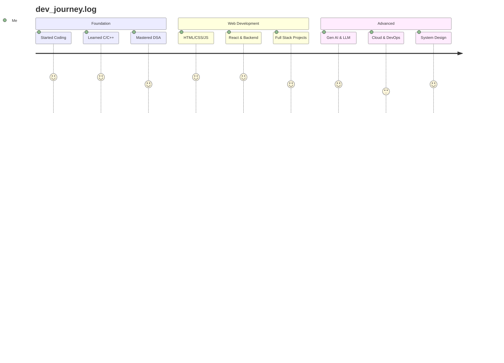
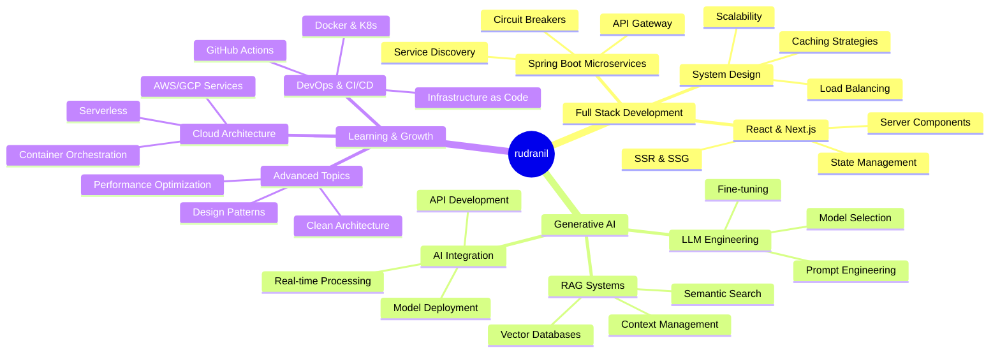

<div align="center">
  
</div>

<div align="center">

```text
╔══════════════════════════════════════════════════════════════╗
║  root@rudranil:~$ whoami                                       ║
║  > Full Stack Developer · Generative AI Engineer                ║
║                                                                  ║
║  root@rudranil:~$ status --current                             ║
║  > Final-year CS Student @ Asansol Engineering College (MAKAUT) ║
║  > Based in Durgapur, West Bengal, India                        ║
║  > Open to: Internships · Collaborations · Open Source          ║
╚══════════════════════════════════════════════════════════════╝
```

[](https://git.io/typing-svg)

[](https://portfolio-me-ycdu.onrender.com)
[](https://linkedin.com/in/rudranil-goswami-a33340298)
[](https://stackoverflow.com/users/rudranil-goswami)
[](https://x.com/NilTatai77986)
[](mailto:tatairudra39@gmail.com)


</div>

---

## `$ cat about.md`

<table>
<tr>
<td width="55%" valign="top">

```text
rudranil@devbox
──────────────────────────────────────
OS          : Full-Stack Development
Shell       : Django · Spring Boot · Node.js
Frontend    : React · Next.js · TailwindCSS
Focus       : Generative AI · System Design
Learning    : LLM Engineering · Cloud Architecture
Building    : Full Stack E-commerce Platform
Open To     : Collabs · Open Source · Mentorship
Ask Me      : Web Dev, GenAI, Django, Spring Boot,
              Compiler Design, DSA
Philosophy  : "Code with passion, debug with
              patience, deploy with confidence."
──────────────────────────────────────
```

</td>
<td width="45%" valign="top">

</td>
</tr>
</table>

<div align="center">


```mermaid
journey
    title dev_journey.log
    section Foundation
      Started Coding: 5: Me
      Learned C/C++: 5: Me
      Mastered DSA: 4: Me
    section Web Development
      HTML/CSS/JS: 5: Me
      React & Backend: 5: Me
      Full Stack Projects: 4: Me
    section Advanced
      Gen AI & LLM: 4: Me
      Cloud & DevOps: 3: Me
      System Design: 4: Me
```

</div>

---

## `$ ls -la tech-stack/`

<div align="center">

</div>

<br/>

<details open>
<summary><code>> languages/</code></summary>
<br/>

<div align="center">


</div>
</details>

<details open>
<summary><code>> frontend/</code></summary>
<br/>

<div align="center">


</div>
</details>

<details open>
<summary><code>> backend_and_ai/</code></summary>
<br/>

<div align="center">


</div>
</details>

<details open>
<summary><code>> databases_and_cloud/</code></summary>
<br/>

<div align="center">


</div>
</details>

<details open>
<summary><code>> tools_and_devops/</code></summary>
<br/>

<div align="center">


</div>
</details>

---

## `$ ./fetch_github_stats.sh`

<div align="center">


</div>

<div align="center">
  <picture>
    <source media="(prefers-color-scheme: dark)" srcset="https://raw.githubusercontent.com/rudra00434/rudra00434/output/github-contribution-grid-snake-dark.svg">
    <source media="(prefers-color-scheme: light)" srcset="https://raw.githubusercontent.com/rudra00434/rudra00434/output/github-contribution-grid-snake.svg">
    
  </picture>
</div>

---

## `$ ls projects/ --sort=featured`

<table>
<tr>
<td width="50%" valign="top">

```text
$ cd EcomCRM/ && cat README.md
```
### 🛒 EcomCRM
> AI-powered smart business intelligence system with analytics dashboard

<div align="center">


</div>

Full-stack e-commerce & CRM platform — real-time inventory management, admin dashboard, auth, cart & order tracking, and analytics, enhanced with LLM-powered insights via LangChain.

<p align="center">
<a href="#"></a>
<a href="#"></a>
</p>

---

```text
$ cd SoulPlayer/ && cat README.md
```
### 🎧 SoulPlayer
> Music, podcast & radio streaming platform with live listening rooms

<div align="center">


</div>

Real-time listening rooms over WebSockets via Django Channels, JioSaavn API integration for streaming & trending tracks, voice search, and a glassmorphism dark UI with Redis-backed caching.

<p align="center">
<a href="#"></a>
<a href="#"></a>
</p>

</td>
<td width="50%" valign="top">

```text
$ cd ai-chatbot-rag/ && cat README.md
```
### 🤖 AI Chatbot with RAG
> LLM-powered chatbot with Retrieval Augmented Generation

<div align="center">


</div>

Intelligent chatbot powered by LLMs with semantic search and RAG. Implements context-aware responses and conversation memory for grounded, accurate answers.

<p align="center">
<a href="#"></a>
<a href="#"></a>
</p>

---

```text
$ cd RansomwareShield/ && cat README.md
```
### 🛡️ RansomwareShield
> AI-powered advanced cybersecurity platform

<div align="center">


</div>

Multi-engine ML ensemble (Random Forest) combined with YARA rule matching and VirusTotal threat intelligence, plus an LLM-based (Groq/LangChain) threat explainer, honeyfile traps, and WebSocket integration for real-time ransomware detection. 🏆 Top 9 of 150+ at SIH 2025.

<p align="center">
<a href="#"></a>
<a href="https://github.com/rudra00434/Ransomware_Shield.git"></a>
</p>

</td>
</tr>
</table>

---

## `$ cat current_focus.json`

<div align="center">


```mermaid
mindmap
  root((rudranil))
    Full Stack Development
      Spring Boot Microservices
        API Gateway
        Service Discovery
        Circuit Breakers
      React & Next.js
        Server Components
        SSR & SSG
        State Management
      System Design
        Scalability
        Load Balancing
        Caching Strategies
    Generative AI
      LLM Engineering
        Prompt Engineering
        Fine-tuning
        Model Selection
      RAG Systems
        Vector Databases
        Semantic Search
        Context Management
      AI Integration
        API Development
        Real-time Processing
        Model Deployment
    Learning & Growth
      Cloud Architecture
        AWS/GCP Services
        Serverless
        Container Orchestration
      DevOps & CI/CD
        Docker & K8s
        GitHub Actions
        Infrastructure as Code
      Advanced Topics
        Design Patterns
        Clean Architecture
        Performance Optimization
```

</div>

---

## `$ wakatime --weekly`

<!--START_SECTION:waka-->
```text
Java         8 hrs 45 mins   ███████████░░░░░░░░░░   45.2%
Python       5 hrs 20 mins   ███████░░░░░░░░░░░░░░   27.6%
JavaScript   3 hrs 15 mins   ████░░░░░░░░░░░░░░░░░   16.8%
SQL          1 hr 30 mins    ██░░░░░░░░░░░░░░░░░░░    7.8%
Others       0 hrs 30 mins   █░░░░░░░░░░░░░░░░░░░░    2.6%
```
<!--END_SECTION:waka-->

---

## `$ cat skills.yaml`

<table>
<tr>
<td width="50%">

```text
# backend_development
Java Spring Boot     ████████████████████░   95%
Python Django        ███████████████████░░   90%
Node.js & Express    ████████████████░░░░░   85%
RESTful API Design   ███████████████████░░   90%
Microservices        ███████████████░░░░░░   80%
```

```text
# database_and_cloud
MySQL & PostgreSQL   ███████████████████░░   90%
MongoDB              ████████████████░░░░░   85%
Firebase             ███████████████░░░░░░   80%
Redis Caching        ██████████████░░░░░░░   75%
AWS Services         ███████████████░░░░░░   78%
```

</td>
<td width="50%">

```text
# frontend_development
React.js             ████████████████████░   90%
JavaScript/ES6+      ███████████████████░░   88%
HTML5 & CSS3         ████████████████████░   95%
TailwindCSS          ████████████████░░░░░   85%
Redux State Mgmt     ███████████████░░░░░░   80%
```

```text
# ai_ml_and_tools
Gen AI & LLMs        ████████████████░░░░░   82%
Python ML Libraries  ███████████████░░░░░░   80%
Git & GitHub         ████████████████████░   95%
Docker & K8s         ███████████████░░░░░░   78%
CI/CD Pipelines      ██████████████░░░░░░░   72%
```

</td>
</tr>
</table>

---

## `$ cat achievements.log`

<div align="center">


</div>

```diff
+ [OK] Mastered Full Stack Development with Java & Python
+ [OK] Successfully integrated AI/ML into production applications
+ [OK] Deployed multiple scalable microservices architectures
+ [OK] Contributed to open source projects, helped 100+ developers
+ [OK] Continuous learner — always exploring new technologies
+ [OK] Built a tool that's now used by multiple development teams
```

---

## `$ cat learning_path.md`

<div align="center">


```mermaid
graph LR
    A[Programming<br/>Fundamentals] --> B[Web<br/>Development]
    B --> C[Backend<br/>Frameworks]
    C --> D[Database<br/>Design]
    D --> E[Full Stack<br/>Projects]
    E --> F[Cloud &<br/>DevOps]
    F --> G[AI/ML<br/>Integration]
    G --> H[System<br/>Design]
    H --> I[Currently:<br/>LLM Engineering]

    style A fill:#0D1117,stroke:#39FF14,color:#C9D1D9
    style B fill:#0D1117,stroke:#39FF14,color:#C9D1D9
    style C fill:#0D1117,stroke:#39FF14,color:#C9D1D9
    style D fill:#0D1117,stroke:#39FF14,color:#C9D1D9
    style E fill:#0D1117,stroke:#39FF14,color:#C9D1D9
    style F fill:#0D1117,stroke:#00FFFF,color:#C9D1D9
    style G fill:#0D1117,stroke:#00FFFF,color:#C9D1D9
    style H fill:#0D1117,stroke:#00FFFF,color:#C9D1D9
    style I fill:#39FF14,stroke:#39FF14,color:#000000
```

</div>

---

## `$ cat working_on.todo`

| 🎯 current | 📖 learning | 🔮 next |
|:---|:---|:---|
| E-Commerce Platform | Advanced System Design | Contribute to Major OSS |
| AI Chatbot with RAG | Kubernetes & Cloud Native | Build SaaS Product |
| Developer Tools | LLM Fine-tuning | Tech Blog & Tutorials |
| Open Source Contributions | Performance Optimization | Speaking at Conferences |

---

## `$ cat collaborate.md`

<table>
<tr>
<td width="33%" align="center">
<code>&gt; open_source</code>
<br/><br/>
<sub>Contributing to meaningful projects that impact developers worldwide</sub>
</td>
<td width="33%" align="center">
<code>&gt; ai_projects</code>
<br/><br/>
<sub>Building intelligent applications with Gen AI and LLMs</sub>
</td>
<td width="33%" align="center">
<code>&gt; innovation</code>
<br/><br/>
<sub>Creating tools that solve real problems and enhance productivity</sub>
</td>
</tr>
</table>

---

## `$ cat 2026_goals.todo`

| goal | progress | status |
|:---|:---|:---|
| 🚀 Launch SaaS Product | ████████░░ 80% | in_progress |
| 📝 Write 50 Technical Articles | ████░░░░░░ 40% | in_progress |
| 🤝 Contribute to 10 OSS Projects | ██████░░░░ 60% | in_progress |
| 🎓 Master System Design | ███████░░░ 70% | in_progress |
| 🌟 Reach 100 GitHub Stars | ███████░░░ 70% | in_progress |
| 🏅 Speak at Tech Conference | ████░░░░░░ 40% | planned |

---

## `$ ./fun_facts.sh`

<div align="center">

```text
$ when not coding:
> exploring new music genres
> reading tech blogs & documentation
> playing strategic games
> learning new technologies
> working out
> trying new cuisines
```


</div>

```yaml
editor:   VS Code — Tokyo Night Theme
terminal: Oh My Zsh + Powerlevel10k
font:     Fira Code (ligatures on)
coffee:   black, no sugar
music:    lo-fi beats while coding
keyboard: mechanical, blue switches
```

---

## `$ contact --send -v`

<div align="center">

```diff
+ open to collaborating on innovative projects
+ always learning and exploring new technologies
+ feel free to reach out for technical discussions
+ happy to help with debugging and code reviews
```

[](https://portfolio-me-ycdu.onrender.com)
[](mailto:tatairudra39@gmail.com)
[](https://linkedin.com/in/rudranil-goswami-a33340298)
[](https://x.com/NilTatai77986)

<br/>

> "First, solve the problem. Then, write the code." — John Johnson
>
> "Code is like humor. When you have to explain it, it's bad." — Cory House
>
> "Make it work, make it right, make it fast." — Kent Beck

<br/>


`$ echo "thanks for visiting — have a great day"`

</div>


